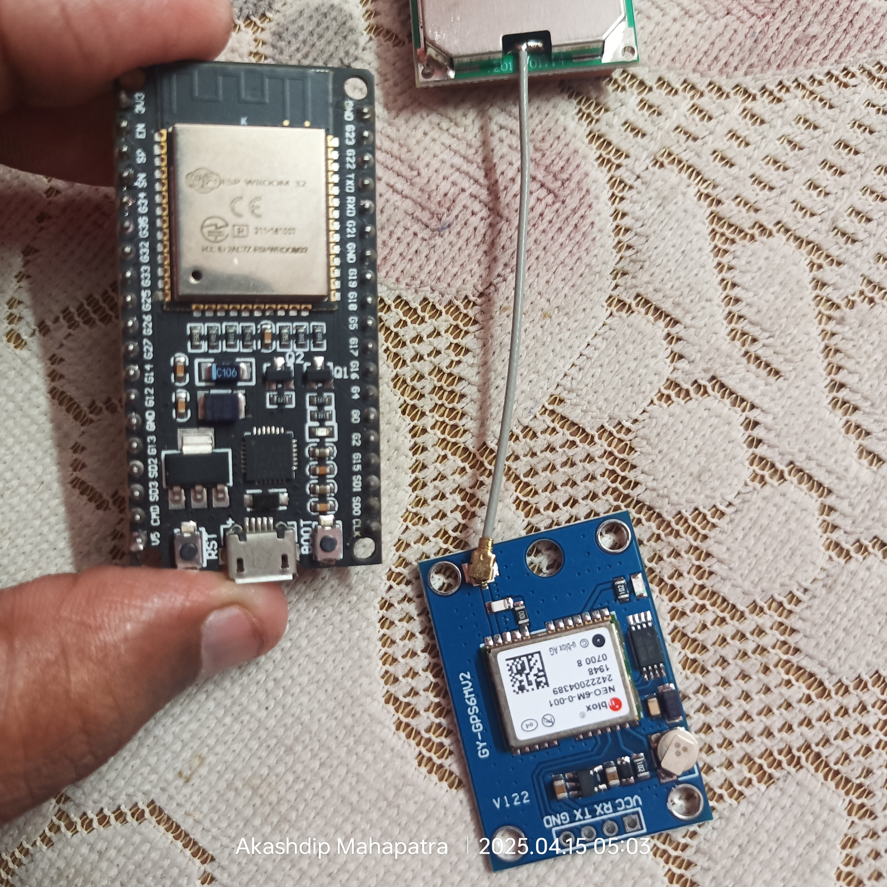

# GPS-with-ESP
> ESP32 (with GY-GPS6MU2) works as an **Access Point** and shows the GPS coordinates on a web page when the user connects to it.

---



### **Required Components**:
1. **ESP32 (WROOM-32)** – microcontroller with built-in Wi-Fi
2. **GY-GPS6MU2** – GPS module (uses NEO-6M GPS chipset)
3. **Jumper Wires** – for connecting ESP32 to GPS

### **Connections**:
- **GY-GPS6MU2 to ESP32**:
  - **VCC** → **3V3** (on ESP32)
  - **GND** → **GND** (on ESP32)
  - **TX** → **RX (GPIO 16)** (on ESP32)
  - **RX** → **TX (GPIO 17)** (on ESP32)

> **Note:** The GPS module communicates over **Serial**. We will use hardware Serial (UART) on **GPIO 16 (RX)** and **GPIO 17 (TX)**.

---

### **Code Explanation**:

1. The ESP32 will function as an **Access Point**.
2. The **GPS module (GY-GPS6MU2)** will fetch the location using **NMEA** protocol.
3. The ESP32 will serve a **web page** showing the GPS coordinates when users connect to the AP.

---

### **Code for ESP32**:

```cpp
#include <Arduino.h>
#include <WiFi.h>
#include <HardwareSerial.h>
#include <TinyGPS++.h>

// Set up Wi-Fi credentials
const char *ssid = "ESP32-GPS-AP"; // Wi-Fi Name (Access Point)
const char *password = "12345678"; // Wi-Fi Password (min 8 chars)

// Set up GPS serial communication
HardwareSerial mySerial(1);  // Using UART1 (RX = GPIO 16, TX = GPIO 17)
TinyGPSPlus gps;  // GPS object

// IP address for AP
IPAddress local_IP(192, 168, 4, 1);   // Static IP
IPAddress gateway(192, 168, 4, 1);    // Gateway IP (same as AP)
IPAddress subnet(255, 255, 255, 0);   // Subnet mask

// Create web server on port 80
WiFiServer server(80);

void setup() {
  // Start Serial Monitor for debugging
  Serial.begin(115200);
  
  // Set up GPS serial port
  mySerial.begin(9600, SERIAL_8N1, 16, 17);  // Baud rate = 9600
  
  // Set up Wi-Fi AP mode
  WiFi.softAPConfig(local_IP, gateway, subnet);
  WiFi.softAP(ssid, password);
  Serial.println("Access Point Started!");
  Serial.print("Connect to: "); Serial.println(ssid);
  Serial.print("IP address: "); Serial.println(WiFi.softAPIP());

  // Start web server
  server.begin();
}

void loop() {
  // Wait for a client to connect
  WiFiClient client = server.available();
  if (!client) {
    return;
  }

  // Wait until the client sends data
  Serial.println("Client connected!");
  while (!client.available()) {
    delay(1);
  }

  // Read HTTP request
  String request = client.readStringUntil('\r');
  Serial.println(request);
  client.flush();

  // Read GPS data
  while (mySerial.available() > 0) {
    gps.encode(mySerial.read());
  }

  // GPS location logic
  float latitude = gps.location.lat();
  float longitude = gps.location.lng();

  // HTML content
  String html = "<!DOCTYPE html><html>";
  html += "<head><meta name=\"viewport\" content=\"width=device-width, initial-scale=1\">";
  html += "<style>body{font-family:sans-serif;text-align:center;}h2{color:green;}</style></head>";
  html += "<body><h2>GPS Location</h2>";
  
  if (gps.location.isUpdated()) {
    html += "<p>Latitude: " + String(latitude, 6) + "</p>";
    html += "<p>Longitude: " + String(longitude, 6) + "</p>";
  } else {
    html += "<p>Waiting for GPS fix...</p>";
  }

  html += "</body></html>";

  // Send response
  client.print("HTTP/1.1 200 OK\r\nContent-Type: text/html\r\n\r\n");
  client.print(html);

  delay(1);
  Serial.println("Client disconnected");
}

```

---

### **Explanation of the Code**:

1. **Wi-Fi AP Mode**:
   - The ESP32 creates an Access Point with the **SSID "ESP32-GPS-AP"** and **password "12345678"**.
   - The IP address of the ESP32 Access Point is set to `192.168.4.1`.

2. **GPS Communication**:
   - The GPS module is connected via **UART1** (RX on GPIO 16, TX on GPIO 17) with a baud rate of `9600`.
   - GPS data is read using the **TinyGPS++** library.

3. **Web Server**:
   - When a user connects to the Access Point and opens the browser, the ESP32 serves an HTML page with the GPS location.
   - The coordinates are displayed in **Latitude** and **Longitude** format.
   - If no GPS fix is available, it shows “Waiting for GPS fix…”.

---

### **Libraries Required**:

You’ll need to install the following libraries via **PlatformIO**:

- **TinyGPS++** – For parsing the GPS data.
- **WiFi.h** – For the ESP32 Wi-Fi functionalities.

You can install them by adding these lines in your **`platformio.ini`**:

```ini
[env:esp32dev]
platform = espressif32
board = esp32dev
framework = arduino

lib_deps =
  esp32 WiFi
  mikalhart/TinyGPSPlus
```

---

### **Testing**:

1. **Upload** the code to your ESP32 using PlatformIO.
2. Once uploaded, open the **Serial Monitor** to check the status and IP address of the Access Point.
3. **Connect** your computer or mobile phone to the **Wi-Fi** network `ESP32-GPS-AP`.
4. Open a browser and type **http://192.168.4.1** to view the GPS location.

---

### **Troubleshooting**:

1. **No GPS fix**: Make sure the GPS module is in an open area to receive satellite signals.
2. **Wi-Fi issues**: Ensure your device is connected to the AP and the IP `192.168.4.1` is entered correctly in the browser.
3. **Data rate**: If your GPS module doesn’t provide a fix, try to wait for a few minutes for it to lock on to satellites.

---

<p align="center">
  
  
</p>

---

# Update the Code : for Coordinate
> Using `platformio`

```cpp
#include <WiFi.h>
#include <TinyGPS++.h>
#include <HardwareSerial.h>
#include <WebServer.h>

// ==== Replace with your WiFi credentials ====
const char* ssid = "ESP-32-GPS";
const char* password = "12345678";

// ==== Web server on port 80 ====
WebServer server(80);

// ==== GPS Setup ====
TinyGPSPlus gps;
HardwareSerial gpsSerial(2);  // Use UART2
const int RXD2 = 16;
const int TXD2 = 17;

// HTML Page Template
String htmlPage() {
  String page = "<!DOCTYPE html><html><head><meta name='viewport' content='width=device-width, initial-scale=1'>";
  page += "<style>body{font-family:Arial; text-align:center;}h2{color:#2F4F4F;}</style></head><body>";
  page += "<h2>ESP32 GPS WebServer</h2>";

  if (gps.location.isValid()) {
    page += "<p><strong>Latitude:</strong> " + String(gps.location.lat(), 6) + "</p>";
    page += "<p><strong>Longitude:</strong> " + String(gps.location.lng(), 6) + "</p>";
    page += "<p><strong>Altitude:</strong> " + String(gps.altitude.meters()) + " meters</p>";
    page += "<p><strong>Satellites:</strong> " + String(gps.satellites.value()) + "</p>";
    page += "<p><strong>Speed:</strong> " + String(gps.speed.kmph()) + " km/h</p>";
  } else {
    page += "<p><strong>Waiting for valid GPS data...</strong></p>";
  }

  page += "<br><p>Refresh this page to get updated GPS data.</p>";
  page += "</body></html>";
  return page;
}

void handleRoot() {
  server.send(200, "text/html", htmlPage());
}

void setup() {
  Serial.begin(115200);
  gpsSerial.begin(9600, SERIAL_8N1, RXD2, TXD2);

  // Connect to WiFi
  WiFi.softAP(ssid, password);
  Serial.println("WiFi started");
  Serial.println("IP address: ");
  Serial.println(WiFi.softAPIP());

  // Start Web Server
  server.on("/", handleRoot);
  server.begin();
  Serial.println("Web server started");
}

void loop() {
  while (gpsSerial.available() > 0) {
    gps.encode(gpsSerial.read());
  }

  server.handleClient();
}
```

#### Update in**`platformio.ini`**:

```ini
[env:esp32dev]
platform = espressif32
board = esp32dev
framework = arduino

lib_deps =
  esp32 WiFi
  mikalhart/TinyGPSPlus
```


https://github.com/user-attachments/assets/dde5140e-a01b-489d-9215-c113c564de4b

### But not give the exect 📍 PIN point


<p align="center">
  
  
</p>
