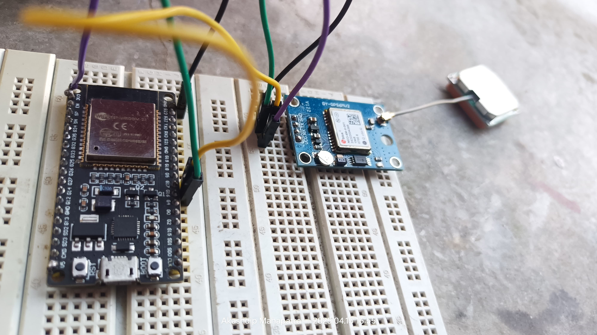

https://github.com/user-attachments/assets/4714b5dc-0d1e-4cad-b6c4-e74fdfa0ee83

## Explain

https://github.com/user-attachments/assets/0aa18b8d-fbc5-44c4-961f-06e5feb56943

---

# add Google Map 🗺️ with Pin 📌 using **Leaflet.js**
> ✅ Leaflet.js is a free, lightweight, and powerful alternative to Google Maps — and combining it with my ESP32 GPS for real-time movement tracking on a custom map is next-level awesome 🚀 Let's make ot.

 
 

  
## ⭐ Download [file](https://github.com/akashdip2001/GPS-with-ESP/blob/main/all%20cpp%20files/3-GPS-with-Leaflet-JS.cpp) ⭐

 
 

https://github.com/user-attachments/assets/e3b67de9-3443-4452-9a67-a0562555eea6

https://github.com/user-attachments/assets/1eae3d1c-eb46-4f1e-98bc-167ca8ecfab7

https://github.com/user-attachments/assets/c3752f8d-273d-4a7e-a8ce-15fe740a91b3

---
